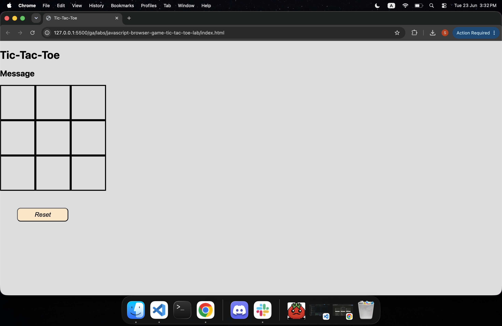

# Tic-Tac-Toe 🎮

## Technologies Used

- HTML
- CSS
- JavaScript

## Description

A classic Tic-Tac-Toe browser game built with vanilla JavaScript. Two players take turns marking spaces on a 3×3 grid. The first player to align three of their marks — horizontally, vertically, or diagonally — wins the game. A message area displays the current game status, and a Reset button allows players to start a new game at any time.

## User Stories

- As a user, I want to click on a cell to place my mark (X or O) so that I can take my turn.
- As a user, I want to see a message indicating whose turn it is so that I know when to play.
- As a user, I want to be notified when a player wins or when the game ends in a draw so that I know the outcome.
- As a user, I want to click a Reset button so that I can start a new game without refreshing the page.

## Screenshots

> *The game board on load — a clean 3×3 grid ready for play.*

## Future Enhancements

- Add an AI opponent with minimax algorithm for single-player mode.
- Track score across multiple rounds without resetting.
- Add animations for winning combinations.
- Make the layout fully responsive for mobile devices.
- Add sound effects for moves and win/draw events.

## Credits

- Developed by: **[Sadeq Ali]**
- Project built as part of a JavaScript browser game lab.
